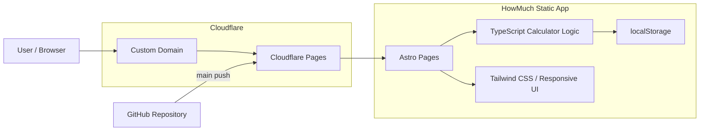

<div align="center">


# ⚡ HowMuch

### 필요한 계산, 바로.

**평 · 인터넷 속도 · 데이터 용량 · 온도 · 연비 · 학점까지**  
**자주 쓰는 계산을 로그인 없이 빠르게 처리하는 정적 웹 도구 모음입니다.**

[](https://how-much.kro.kr)
[](https://astro.build/)
[](https://www.typescriptlang.org/)
[](https://tailwindcss.com/)
[](https://pages.cloudflare.com/)

</div>

---

## 🚀 서비스 개요

**HowMuch**는 필요한 순간 바로 열어 숫자를 입력하고 결과를 확인할 수 있는 계산·단위 변환 웹사이트입니다.

별도의 회원가입이나 서버 요청 없이 계산이 **사용자의 브라우저에서 즉시 처리**되며, 모바일과 데스크톱 모두에서 빠르게 사용할 수 있도록 가볍게 구성했습니다.

현재는 생활·인터넷·데이터·자동차·학교 카테고리의 계산기를 제공하며, 새로운 도구를 독립 페이지 형태로 계속 확장할 수 있도록 설계했습니다.

### 🔗 주요 페이지

| 서비스 | URL |
| --- | --- |
| HowMuch 홈 | [how-much.kro.kr](https://how-much.kro.kr) |
| 평 · 제곱미터 변환 | [how-much.kro.kr/pyeong](https://how-much.kro.kr/pyeong) |
| Mbps · MB/s 변환 | [how-much.kro.kr/mbps](https://how-much.kro.kr/mbps) |
| 다운로드 시간 계산 | [how-much.kro.kr/download-time](https://how-much.kro.kr/download-time) |
| 데이터 용량 변환 | [how-much.kro.kr/storage](https://how-much.kro.kr/storage) |
| 온도 변환 | [how-much.kro.kr/temperature](https://how-much.kro.kr/temperature) |
| 연비 변환 | [how-much.kro.kr/fuel-efficiency](https://how-much.kro.kr/fuel-efficiency) |
| 학점 평균 계산 | [how-much.kro.kr/gpa](https://how-much.kro.kr/gpa) |

---

## ✨ 핵심 기능

### 🧮 계산기 7종

| 카테고리 | 도구 | 예시 |
| --- | --- | --- |
| 생활 | 평 ↔ 제곱미터 | 24평 → 79.34㎡ |
| 인터넷 | Mbps ↔ MB/s | 500Mbps → 62.5MB/s |
| 인터넷 | 다운로드 시간 | 10GB @ 500Mbps → 약 2분 40초 |
| 데이터 | KB / MB / GB / TB / KiB / MiB / GiB / TiB | 1024MiB → 1GiB |
| 생활 | 섭씨 / 화씨 / 켈빈 | 25°C → 77°F |
| 자동차 | km/L ↔ L/100km | 15km/L → 6.67L/100km |
| 학교 | 학점 가중 평균 | 과목별 학점 × 평점 반영 |

### 🔎 도구 검색 & 카테고리 필터

- 도구명과 관련 키워드 실시간 검색
- 생활 / 인터넷 / 데이터 / 자동차 / 학교 카테고리 필터
- 키보드 `/` 단축키로 검색창 바로 포커스
- 검색 결과 개수 실시간 표시
- 모바일에서는 카테고리 가로 스크롤 지원

### 📱 반응형 UI

- 데스크톱 4열 → 태블릿 3·2열 → 모바일 1열 자동 전환
- 모바일에서 히어로·검색창·카드 크기 최적화
- 카테고리 스크롤바를 숨기고 터치 탐색 유지
- 공통 Header / Footer / Tool Layout 구성

### 🔐 브라우저에서 처리

- 계산을 위한 외부 API 요청 없음
- 회원가입 / 로그인 없음
- 계산 입력값 서버 저장 없음
- GPA 계산기의 과목 입력값만 브라우저 `localStorage`에 저장

### 🎓 학점 가중 평균

단순한 4.5 ↔ 4.3 임의 환산 대신 과목별 **이수학점 × 평점**을 반영해 실제 가중 평균을 계산합니다.

- 4.5 / 4.3 만점 선택
- 과목 추가·삭제
- 이수학점과 평점 입력
- 총 이수학점과 가중 평균 즉시 계산
- 최근 입력값 브라우저 저장

### 🔎 SEO

- 페이지별 title / description
- canonical URL
- Open Graph / Twitter Card
- JSON-LD `WebSite` 구조화 데이터
- sitemap 자동 생성
- robots.txt 자동 생성
- 1200×630 기본 Open Graph 이미지
- 계산기별 독립 URL 제공

---

## 🛠 기술 스택

### Frontend

|  |  |  |
| :---: | :---: | :---: |
| Astro 7.3.3 | TypeScript 6.0.3 | Tailwind CSS 4.3.3 |

### Deployment

|  |  |
| :---: | :---: |
| Cloudflare Pages | GitHub Actions |

HowMuch는 서버 렌더링 없이 Astro에서 정적 파일을 생성한 뒤 Cloudflare Pages에 배포합니다.

---

## 🏗 시스템 구조



### 계산 흐름

```text
사용자 입력
   ↓
브라우저 TypeScript 계산
   ↓
즉시 결과 표시
   ↓
외부 서버 전송 없음
```

---

## 📁 프로젝트 구조

```text
HowMuch/
├── public/
│   ├── favicon.svg          # 사이트 아이콘
│   └── og-default.png       # 기본 Open Graph 이미지
│
├── src/
│   ├── components/
│   │   ├── Header.astro     # 공통 헤더
│   │   ├── Footer.astro     # 공통 푸터
│   │   ├── ToolCard.astro   # 메인 계산기 카드
│   │   └── ToolLayout.astro # 계산기 상세 공통 레이아웃
│   │
│   ├── data/
│   │   └── tools.ts         # 도구 목록·카테고리·검색 키워드
│   │
│   ├── layouts/
│   │   └── BaseLayout.astro # SEO / 공통 HTML 레이아웃
│   │
│   ├── pages/
│   │   ├── index.astro
│   │   ├── pyeong.astro
│   │   ├── mbps.astro
│   │   ├── download-time.astro
│   │   ├── storage.astro
│   │   ├── temperature.astro
│   │   ├── fuel-efficiency.astro
│   │   ├── gpa.astro
│   │   ├── robots.txt.ts
│   │   └── 404.astro
│   │
│   └── styles/
│       └── global.css
│
├── .github/workflows/
│   └── ci.yml
├── astro.config.mjs
├── package.json
├── package-lock.json
└── tsconfig.json
```

---

## ⚙️ 로컬 실행

### 1. 저장소 Clone

```bash
git clone https://github.com/dh1180/HowMuch.git
cd HowMuch
```

### 2. 의존성 설치

Node.js 22 환경을 권장합니다.

```bash
npm install
```

### 3. 개발 서버 실행

```bash
npm run dev
```

기본 개발 주소:

```text
http://localhost:4321
```

### 4. 타입 검사 & 정적 빌드

```bash
npm run build
```

`npm run build`는 다음 순서로 실행됩니다.

```text
astro check
    ↓
astro build
    ↓
dist/
```

---

## 🚢 Deployment

서비스는 **Cloudflare Pages + 외부 DNS CNAME** 구성으로 운영합니다.

### Cloudflare Pages 빌드 설정

| 항목 | 값 |
| --- | --- |
| Production branch | `main` |
| Build command | `npm run build` |
| Build output directory | `dist` |
| Root directory | `/` |
| Node.js | 22 |

### Custom Domain

현재 서비스 도메인:

```text
https://how-much.kro.kr
```

외부 DNS에서 Pages 프로젝트 주소를 CNAME으로 연결합니다.

```text
how-much.kro.kr
        ↓ CNAME
howmuch-aoh.pages.dev
```

Cloudflare Pages의 Custom Domains에 도메인을 먼저 등록한 후 DNS 레코드를 설정합니다.

### SITE_URL

배포 환경의 `SITE_URL`은 canonical, Open Graph URL, sitemap, robots.txt 생성에 사용합니다.

```env
SITE_URL=https://how-much.kro.kr
```

---

## 🧪 CI

`main` push와 Pull Request마다 GitHub Actions에서 다음 검증을 수행합니다.

```text
Checkout
   ↓
Node.js 22
   ↓
npm install
   ↓
astro check
   ↓
astro build
```

타입 오류나 정적 빌드 오류가 발생하면 CI가 실패하도록 구성되어 있습니다.

---

## ➕ 새로운 계산기 추가

새 도구를 추가할 때는 기본적으로 다음 두 곳을 수정합니다.

### 1. 계산기 페이지 생성

예:

```text
src/pages/example.astro
```

### 2. 도구 목록 등록

`src/data/tools.ts`에 카드 정보와 검색 키워드를 추가합니다.

```ts
{
  slug: "example",
  href: "/example",
  name: "새 계산기",
  description: "계산기에 대한 설명",
  category: "생활",
  icon: "+",
  example: "예시 결과",
  keywords: ["검색", "키워드"],
}
```

메인 화면의 검색·카테고리·카드 목록에 자동으로 반영됩니다.

---

## 📌 계산 원칙

HowMuch는 단순히 숫자를 바꾸는 것보다 **단위의 정의와 사용 맥락을 명확히 구분하는 것**을 기본 원칙으로 합니다.

- 평: `1평 = 400 / 121㎡ ≈ 3.305785㎡`
- 네트워크 속도: `1 Byte = 8 bit`
- 저장 용량
  - KB / MB / GB / TB: 1,000 단위
  - KiB / MiB / GiB / TiB: 1,024 단위
- 연비: `km/L ↔ L/100km`는 역수 관계
- 다운로드 시간: 파일 크기(Byte)와 회선 속도(bit/s)를 구분
- GPA: 이수학점에 따른 가중 평균 계산

실제 네트워크 속도, 학교별 학점 규정 등 환경에 따라 달라질 수 있는 값은 계산 페이지에 별도 안내를 표시합니다.

---

## 👨‍💻 Maintainer

<div align="center">

[](https://github.com/dh1180)

**HowMuch**  
필요한 계산을 찾고, 입력하고, 바로 확인하는 가벼운 웹 도구 모음

</div>
